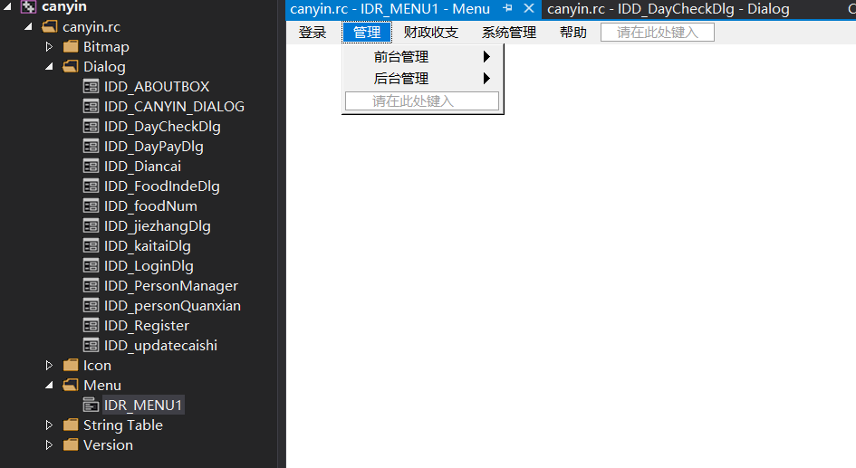

# 绪论

- 基本结构

  

- 包含菜单栏、工具栏、状态栏

# 菜单栏、工具栏、状态栏

- 主对话框的OnInitDialog虚函数初始化

- 1.添加菜单资源

  

- 2.添加变量

  ~~~c++
  CMenu m_menu;
  CImageList m_imageList;
  CToolBar m_toolbar;
  CStatusBar m_statusBar;
  ~~~

- 3.添加ICON资源之后，代码初始化

  ~~~c++
  //添加菜单
  m_menu.LoadMenu(IDR_MENU1);
  SetMenu(&m_menu);
  
  //添加工具栏
  m_imageList.Create(32, 32, ILC_COLOR24 | ILC_MASK, 1, 1);//创建图像列表
  //关联图像
  m_imageList.Add(AfxGetApp()->LoadIcon(IDI_ICON1));
  m_imageList.Add(AfxGetApp()->LoadIcon(IDI_ICON2));
  m_imageList.Add(AfxGetApp()->LoadIcon(IDI_ICON3));
  m_imageList.Add(AfxGetApp()->LoadIcon(IDI_ICON4));
  m_imageList.Add(AfxGetApp()->LoadIcon(IDI_ICON5));
  m_imageList.Add(AfxGetApp()->LoadIcon(IDI_ICON6));
  //数组控制工具栏个数
  UINT Array[6];
  for (int i = 0; i < 6; ++i) {
      Array[i] = 9000 + i;//给工具栏的按钮下索引ID
  }
  m_toolbar.Create(this);//创建工具栏
  m_toolbar.SetButtons(Array, 6);//设置六个按钮
  //给按钮添加文本
  m_toolbar.SetButtonText(0, _T("系统登录"));
  m_toolbar.SetButtonText(1, _T("开台"));
  m_toolbar.SetButtonText(2, _T("顾客买单"));
  m_toolbar.SetButtonText(3, _T("本日收入"));
  m_toolbar.SetButtonText(4, _T("员工注册"));
  m_toolbar.SetButtonText(5, _T("退出系统"));
  m_toolbar.GetToolBarCtrl().SetButtonWidth(60, 120);//设置按钮宽度
  m_toolbar.GetToolBarCtrl().SetImageList(&m_imageList);//将工具栏和图像连接
  m_toolbar.SetSizes(CSize(70, 60), CSize(28, 40));//设置按钮大小贺图像宽度
  m_toolbar.EnableToolTips(TRUE);//激活鼠标提示功能
  
  
  //数组控制状态栏个数
  UINT statusArray[4];
  
  for (int i = 0; i < 4; ++i) {
      statusArray[i] = 10000 + i;//给状态栏添加索引
  }
  m_statusBar.Create(this);//添加状态栏
  m_statusBar.SetIndicators(statusArray, 4);
  for (int i = 0; i < 4; ++i) {
      m_statusBar.SetPaneInfo(i, statusArray[i], 0, 120);//给每个状态栏设置宽度
  }
  CTime Time;
  Time = CTime::GetCurrentTime();
  CString Str = Time.Format("%Y-%m-%d");
  m_statusBar.SetPaneInfo(2, statusArray[2], 0, 400);
  m_statusBar.SetPaneText(0, _T("餐饮管理系统"));
  m_statusBar.SetPaneText(2, _T("当前日期: ") + Str);
  m_statusBar.SetPaneText(3, _T("版本: version1.0"));
  
  //显示工具栏和状态栏
  RepositionBars(AFX_IDW_CONTROLBAR_FIRST, AFX_IDW_CONTROLBAR_LAST, 0);
  ~~~

# Access数据库连接

- 使用accdb格式数据库

- 1.在pch.h或者stdafx.h预编译头文件添加以下链接数据库代码

  ~~~c++
  //连接数据库，注意32位和64位，以下采用64位dll，因为本地access为64位
  #import "C:\\Program Files\\Common Files\\System\\ado\\msado15.dll" no_namespace rename("EOF","adoEOF")rename("BOF","adoBOF")
  ~~~

- 2.因为theApp可以添加全局变量，在theapp头文件添加定义

  ~~~c++
  _ConnectionPtr m_pConnection;//连接access数据库的链接对象  
  ~~~

- 3.在theApp的cpp文件的InitInstance()函数添加连接数据库代码，注意canyin.accdb应放在和源代码同一目录下，否则位置需更改

  ~~~c++
  AfxEnableControlContainer();
  
  //连接数据库----
  ::CoInitialize(NULL);
  HRESULT hr;
  try
  {
      hr = m_pConnection.CreateInstance("ADODB.Connection");
      if (SUCCEEDED(hr))
      {
          m_pConnection->ConnectionTimeout = 3;
          //使用accdb格式
          CString conStr = _T("Provider=Microsoft.ACE.OLEDB.12.0;")
              _T("Data Source=canyin.accdb;")
              _T("Jet OLEDB:Database Password=");
          hr = m_pConnection->Open((_bstr_t)conStr, "", "", adModeUnknown);
  
          //用mdb格式
          //hr = m_pConnection->Open("Provider=Microsoft.Jet.OLEDB.4.0;Data Source=canyin2.mdb", "", "", adModeUnknown);	//连接数据库
  
      }
  }
  catch (_com_error e)
  {
      CString temp;
      temp.Format(_T("连接数据库错误信息:%s"), e.ErrorMessage());
      ::MessageBox(NULL, temp, _T("提示信息"), NULL);
      return false;
  }
  //连接数据库-----
  
  // 创建 shell 管理器，以防对话框包含
  // 任何 shell 树视图控件或 shell 列表视图控件。
  CShellManager *pShellManager = new CShellManager;
  ~~~

# 注册模块设计

- 设计界面

  

- 利用类向导，设计Edit编辑框变量

  - 添加值
  - UpdateData(TRUE);——获取编辑框的文本
  - UpdateData(FALSE);——赋予编辑框的文本

  

- 手动添加工具栏按钮响应消息

  - h文件

  ~~~c++
  afx_msg void OnBnClickeRegister();
  ~~~

  - cpp文件——创建有模式对话框显示

  ~~~c++
  BEGIN_MESSAGE_MAP(CcanyinDlg, CDialogEx)
  	ON_BN_CLICKED(9004, &CcanyinDlg::OnBnClickeRegister)
  END_MESSAGE_MAP()
      
  //注册消息响应
  void CcanyinDlg::OnBnClickeRegister() {
  	CRegistDlg zhuce;
  	zhuce.DoModal();//显示对话框
  }
  ~~~

# List Ctrl 控件的使用

- 设置view属性为report

  

  

- MFC List Control 使用中，中文输入始终为乱码，无关乎是否多字节字符问题。解决办法是把List Control控件所在的对话框的字体设置为“宋体”。

- 常见初始化，首先利用类向导进行控件和变量的关联，以下的m_MenuShow即为List Control控件。

  ~~~c++
  //为列表控件设置格式
  m_MenuShow.SetExtendedStyle(LVS_EX_GRIDLINES | LVS_EX_FULLROWSELECT | LVS_EX_HEADERDRAGDROP | LVS_EX_FLATSB | LVS_EX_ONECLICKACTIVATE);
  
  //添加列
  m_MenuShow.InsertColumn(0, _T("菜名"), LVCFMT_LEFT, 100, 0);
  m_MenuShow.InsertColumn(1, _T("价格"), LVCFMT_LEFT, 100, 1);
  
  //插入一行数据
  CString caiming1,value1;//记得初始化，这只是例子
  m_MenuShow.InsertItem(0, "");
  m_MenuShow.SetItemText(0, 0, caiming1);
  m_MenuShow.SetItemText(0, 1, value1);
  
  //寻找字符串
  CString str;//记得初始化，这只是例子
  LVFINDINFO info;
  info.flags = LVFI_STRING;//标志表示字符串完全匹配才行
  info.psz = str;
  int index = m_FoodDecrease.FindItem(&info);
  
  //获取所有行数
  int i = m_FoodDecrease.GetItemCount();
  
  //删除所有行数据
  m_daybill.DeleteAllItems();
  
//获取当前鼠标点击的行数，从0开始，没有则返回-1
  int i = m_foodMenu.GetSelectionMark();//获取序号
  ~~~
  

- NM_DBLICK列表双击事件

  - ON_NOTIFY(NM_DBLCLK, IDC_diancai1, &CDiancaiDlg::OnDblclkDiancai1)

  - 

  - ~~~c++
    void CDiancaiDlg::OnDblclkDiancai1(NMHDR *pNMHDR, LRESULT *pResult)
    {
    	LPNMITEMACTIVATE pNMItemActivate = reinterpret_cast<LPNMITEMACTIVATE>(pNMHDR);
    	// TODO: 在此添加控件通知处理程序代码
    	OnBnClickedButtonjiacai();
    	*pResult = 0;
    }
    ~~~

  

# Combo box 控件的使用

- 利用类向导绑定控件

- 属性Type选择为下拉列表

  

- 常见用法，m_nameDesk是绑定的控件变量名称

  ~~~c++
  //添加文本
  CString zhuohao;
  m_nameDesk.AddString(zhuohao);
  
  //设置默认下拉
  m_nameDesk.InsertString(0, _T("Start"));
  m_nameDesk.SetCurSel(0);
  
  //获取当前选择的文本
  CString str;
  m_nameDesk.GetLBText(m_nameDesk.GetCurSel(), str);
  
  //查找选择的序号，从0开始
  int i=m_dropList.GetCurSel();
  ~~~

- 下拉框改变消息响应

  - ON_CBN_SELCHANGE(IDC_DesknameList, &CIndeFoodDlg::OnSelchangeDesknamelist)

  - 

  - ~~~c++
    //下拉框变化消息处理
    void CIndeFoodDlg::OnSelchangeDesknamelist()
    {
    	// TODO: 在此添加控件通知处理程序代码
    	CString str;
    	m_dropList.GetLBText(m_dropList.GetCurSel(), str);
    	if (str == "Start") {
    		m_FoodDecrease.DeleteAllItems();
    		return;
    	}
    	int deskname = atoi(str);
    	CString sql;
    	sql.Format(_T("select * from paybill where 桌号= %d"), deskname);
    	m_pRecord = theApp.m_pConnection->Execute((_bstr_t)sql, NULL, adCmdText);
    	m_FoodDecrease.DeleteAllItems();//下单全部情况
    	while (m_pRecord->adoEOF == 0) {
    		CString caiming, shuliang;
    		caiming = (char*)(_bstr_t)m_pRecord->GetCollect("菜名");
    		shuliang = (char*)(_bstr_t)m_pRecord->GetCollect("数量");
    		m_FoodDecrease.InsertItem(0, "");
    		m_FoodDecrease.SetItemText(0, 0, caiming);
    		m_FoodDecrease.SetItemText(0, 1, shuliang);
    		m_pRecord->MoveNext();
    	}
    }
    ~~~

# Tab Ctrl 控件的使用

- 资源添加Tab Ctrl控件

- 头文件添加tab变量名并用类向导关联，同时添加子对话框的变量，注意子对话框的属性的`Style`选择`Child`。

  

  ~~~c++
  CTabCtrl m_tabR;
  CDayPay m_daypay;
  CDayCheckDlg m_daycheckBill;
  ~~~

- cpp文件关联tab和对话框

  ~~~c++
  //tab初始化
  m_daypay.Create(IDD_DayPayDlg, &m_tabR);
  m_daycheckBill.Create(IDD_DayCheckDlg, &m_tabR);
  m_daypay.ShowWindow(SW_HIDE);
  m_daycheckBill.ShowWindow(SW_HIDE);
  ~~~

- 子对话如何调用主对话框的public变量

  - 使用AfxGetMainWnd()

  ~~~c++
  //退出显示
  void CDayPay::OnBnClickedButtonyiyue()
  {
  	CcanyinDlg* pWin = (CcanyinDlg*)AfxGetMainWnd();
  	pWin->m_daypay.ShowWindow(SW_HIDE);
  	pWin->m_daycheckBill.ShowWindow(SW_HIDE);
  }
  ~~~

  

# MFC使用accdb数据库语法例子

- 注意添加变量

  ~~~c++
  _RecordsetPtr m_pRecord;//数据库数据集
  ~~~

- 主要用法

  ~~~c++
  m_pRecord->adoEOF == 0;
  m_pRecord->MoveNext();
  CString str = (char *)(_bstr_t)m_pRecord->GetCollect("桌号");
  ~~~

- ~~~c++
  //插入或更新数据
  CString sql1;
  sql1.Format("select * from dayBill where [日期]='%s'", dayTime);
  m_pRecord = NULL;
  m_pRecord = theApp.m_pConnection->Execute((_bstr_t)sql1, NULL, adCmdText);
  //更新
  if (m_pRecord->adoEOF == 0) {
      sql1.Format("update dayBill set [收入]= %f where [日期]='%s'", ret, dayTime);
      theApp.m_pConnection->Execute((_bstr_t)sql1, NULL, adCmdText);
  }
  //插入
  else {
      sql1.Format("insert into dayBill([收入],[日期]) values(%f,'%s')", ret, dayTime);
      theApp.m_pConnection->Execute((_bstr_t)sql1, NULL, adCmdText);
  }
  ~~~

- ~~~c++
  _bstr_t sqlToExecute = "select * from Login where [UserName]='" + m_Name + "' and [password]='" + m_Secret + "'";
  
  m_pRecord = theApp.m_pConnection->Execute(sqlToExecute, NULL, adCmdText);
  ~~~

- ~~~c++
  //删除原数据库
  int name_desk = atoi(str1);
  CString sql;
  //注意查询的时候类型和accdb的数据类型一致，否则报错。
  sql.Format(_T("delete from paybill where [桌号]= %d"), name_desk);
  theApp.m_pConnection->Execute((_bstr_t)sql, NULL, adCmdText);
  ~~~

- ~~~c++
  //查询数据
  _bstr_t sql = "select * from tableuse";
  m_pRecord = theApp.m_pConnection->Execute(sql, NULL, adCmdText);
  int i = 0;//控制列表显示
  while (m_pRecord->adoEOF == 0)
  {
      CString str = (char *)(_bstr_t)m_pRecord->GetCollect("桌号");
      int useid = atoi((char *)(_bstr_t)m_pRecord->GetCollect("TableUsedID"));
      m_DeskList.InsertItem(i, "");//插入一行
      m_DeskList.SetItemText(i, 0, str);
      if (useid == 0) {
          m_DeskList.SetItemText(i, 1, "空闲中");
      }
      if (useid == 1) {
          m_DeskList.SetItemText(i, 1, "使用中");
      }
      i++;
      m_pRecord->MoveNext();
  }
  ~~~

# 注意点

- 修改默认的Afxmessagebox的标题——AFX_IDS_APP_TITLE，添加到资源文件的string table里面

  

- 插入数据库表的列最好加[]

  ~~~c++
  //插入用户名、密码和权限，谨记最好加上[]，否则会和sql的关键词混淆报错
  _bstr_t sqlToExecute2 = "insert into Login([UserName],[password],[power]) values('" + m_Name + "','" + m_Password + "',0)";
  theApp.m_pConnection->Execute(sqlToExecute2, NULL, adCmdText);
  ~~~

- 防止项目字符集编码从Unicode改为多字节编码所带来的界面老化的解决办法

  - 预编译头pcb.h修改代码	

  ~~~c++
  //注释掉unicode，中间不注释，同时字符集改为多字节，那么MFC界面不会老化，否则界面很丑
  //#ifdef _UNICODE
  #if defined _M_IX86
  #pragma comment(linker,"/manifestdependency:\"type='win32' name='Microsoft.Windows.Common-Controls' version='6.0.0.0' processorArchitecture='x86' publicKeyToken='6595b64144ccf1df' language='*'\"")
  #elif defined _M_X64
  #pragma comment(linker,"/manifestdependency:\"type='win32' name='Microsoft.Windows.Common-Controls' version='6.0.0.0' processorArchitecture='amd64' publicKeyToken='6595b64144ccf1df' language='*'\"")
  #else
  #pragma comment(linker,"/manifestdependency:\"type='win32' name='Microsoft.Windows.Common-Controls' version='6.0.0.0' processorArchitecture='*' publicKeyToken='6595b64144ccf1df' language='*'\"")
  #endif
  //#endif
  ~~~

- 对话框设置图标

  ~~~c++
  //对话框设置窗口图标
  SetIcon(LoadIcon(AfxGetInstanceHandle(), MAKEINTRESOURCE(IDI_ICON5)), TRUE);
  ~~~

- MFC的`atoi`和`atof`函数

